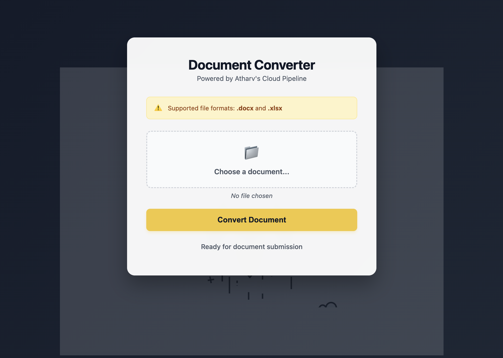

# Enterprise Cloud Document Processing Pipeline

**Course:** Introduction to Cloud Computing
**Institution:** Ostbayerische Technische Hochschule Regensburg (OTH Regensburg)
**Semester:** Summer Term 2026
**Author:** Atharv Aggarwal
**AWS Region:** eu-central-1 (Frankfurt)
**Frontend URL:** https://main.d23wxd1z4g0coi.amplifyapp.com

---

# Table of Contents

1. Overview
2. System Architecture
3. Technology Stack
4. Project Structure
5. Frontend Implementation
6. Backend Implementation
7. Architecture Comparison
8. Security Design
9. Deployment Verification
10. Performance Results
11. Screenshots
12. Conclusion

---

# 1. Overview

This project implements a cloud-native document processing platform capable of converting Microsoft Office documents (`.docx` and `.xlsx`) into PDF format.

The primary engineering goal was to design a scalable cloud solution capable of processing documents in under 10 seconds while minimizing infrastructure management overhead.

Two architectures were evaluated:

### Architecture A

Containerized microservices using:

* Docker
* Amazon ECS Fargate
* Amazon S3
* Adobe PDF Services

### Architecture B (Final Production Choice)

Serverless event-driven architecture using:

* AWS Lambda
* Amazon S3
* API Gateway
* DynamoDB
* Adobe PDF Services API

The serverless architecture was selected due to:

* Lower operational complexity
* Faster processing
* Automatic scaling
* Reduced infrastructure costs

---

# 2. System Architecture

## Production Data Flow

```text
Frontend Client
      │
      ▼
API Gateway
      │
      ▼
GenerateUploadURL Lambda
      │
      ▼
S3 uploads/
      │
      ▼
S3 Event Trigger
      │
      ▼
docx-to-pdf-converter Lambda
      │
      ├── Adobe PDF Services API
      │
      ▼
S3 converted/
      │
      ▼
DynamoDB DocumentMetadata
      │
      ▼
CheckAndGetPDF Lambda
      │
      ▼
Frontend Download Link
```

---

# 3. Technology Stack

| Layer               | Service                |
| ------------------- | ---------------------- |
| Frontend            | HTML, CSS, JavaScript  |
| Hosting             | AWS Amplify            |
| API Layer           | API Gateway            |
| Compute             | AWS Lambda             |
| Storage             | Amazon S3              |
| Database            | DynamoDB               |
| Document Processing | Adobe PDF Services API |
| Monitoring          | Amazon CloudWatch      |
| Security            | IAM + Pre-signed URLs  |

---

# 4. Project Structure

```text
project-root/
│
├── frontend/
│   ├── index.html
│   └── styles.css
│
├── backend/
│   ├── GenerateUploadURL.py
│   ├── docx-to-pdf-converter.py
│   └── CheckAndGetPDF.py
│
└── README.md
```

---

# 5. Frontend Implementation

The frontend follows a two-stage workflow:

1. Upload document directly to S3 using a pre-signed URL.
2. Poll backend services until the PDF becomes available.

## Upload Function

```javascript
async function uploadToS3(uploadUrl, file) {
    const uploadResponse = await fetch(uploadUrl, {
        method: "PUT",
        body: file,
        headers: {
            "Content-Type": file.type
        }
    });

    if (!uploadResponse.ok) {
        throw new Error("Upload failed");
    }
}
```

## Polling Function

```javascript
async function checkIfFileExists(checkApiUrl, fileName) {
    const pdfFileName = fileName.replace(/\.[^.]+$/, ".pdf");

    while (true) {

        const response = await fetch(
            `${checkApiUrl}?file_name=converted/${pdfFileName}`
        );

        if (response.status === 200) {
            const data = await response.json();
            renderDownloadButton(data.url);
            break;
        }

        await new Promise(resolve => setTimeout(resolve, 5000));
    }
}
```

---

# 6. Backend Implementation

## GenerateUploadURL Lambda

Responsibilities:

* Create S3 pre-signed upload URLs
* Return secure upload endpoint
* Restrict upload lifetime

---

## Document Conversion Lambda

Responsibilities:

1. Receive S3 event trigger
2. Download uploaded document
3. Send document to Adobe PDF Services
4. Generate PDF
5. Upload PDF to S3
6. Store metadata in DynamoDB

### Processing Flow

```text
S3 Upload
    │
    ▼
Lambda Trigger
    │
    ▼
Adobe PDF Services
    │
    ▼
Generated PDF
    │
    ▼
S3 converted/
    │
    ▼
DynamoDB Update
```

---

## CheckAndGetPDF Lambda

Responsibilities:

* Query DynamoDB
* Check document status
* Return download URL

### Fallback Logic

1. Exact match lookup
2. Lowercase lookup
3. Partial match scan

This improves robustness against filename formatting differences.

---

# 7. Architecture Comparison

| Metric                    | ECS Fargate      | Serverless |
| ------------------------- | ---------------- | ---------- |
| Average Latency           | 45–60 sec        | 5–7 sec    |
| Infrastructure Management | High             | None       |
| Scaling                   | Limited by tasks | Automatic  |
| Cost Efficiency           | Medium           | High       |
| Deployment Complexity     | High             | Low        |

---

# 8. Security Design

## IAM Least Privilege

Each Lambda function operates under a dedicated IAM execution role.

Permissions are restricted to:

* Required S3 operations
* DynamoDB access
* CloudWatch logging

---

## Pre-Signed URLs

Advantages:

* No direct client access to AWS credentials
* Time-limited access
* Secure uploads

Expiration Time:

```text
1 Hour
```

---

## Temporary Processing

Files are processed inside Lambda's temporary storage:

```text
/tmp
```

and automatically removed after processing.

---

# 9. Deployment Verification

## DynamoDB Status

```bash
aws dynamodb describe-table \
--table-name DocumentMetadata \
--query "Table.TableStatus" \
--region eu-central-1
```

## S3 Notification Configuration

```bash
aws s3api get-bucket-notification-configuration \
--bucket doc-converter-s3-bucket-2026 \
--region eu-central-1
```

## Lambda Functions

```bash
aws lambda list-functions \
--query "Functions[*].FunctionName" \
--output table \
--region eu-central-1
```

---

# 10. Performance Results

### Successful Production Trace

```text
START RequestId: 14e1187a

Targeting file:
uploads/Atharv2.docx

Asset uploaded to Adobe Cloud

Conversion successful

Uploaded:
converted/Atharv2.pdf

DynamoDB updated

END RequestId: 14e1187a
Duration: 4371 ms
```

### Observed Metrics

| Metric                  | Value     |
| ----------------------- | --------- |
| Average Conversion Time | 5–7 sec   |
| Lambda Memory           | 2024 MB   |
| Peak Usage              | 109 MB    |
| Scaling                 | Automatic |
| Availability            | High      |

---

# 11. Screenshots

## Application Dashboard

```markdown

```

## Upload Workflow

```markdown

```

## Successful Conversion

```markdown

```


---

# 12. Conclusion

This project demonstrates the design and deployment of a modern cloud-native document processing platform using AWS serverless technologies.

The final architecture successfully achieved:

* Fully automated document conversion
* Event-driven processing
* Automatic scalability
* Secure uploads using pre-signed URLs
* Low operational cost
* Average processing times below 10 seconds

The implementation validates the effectiveness of serverless computing for enterprise document processing workloads and highlights the benefits of managed cloud services for scalable production systems.
